# ⚡ RTL2GDS_Alchemy

<div align="center">


</div>

`RTL2GDS_Alchemy` is a collection of modules and experiments that document my journey through the **VSD-IAT SoC Tapeout Program**, demonstrating hands-on proficiency in the **RTL-to-GDSII physical design flow** using open-source tools.

This repository is a practical showcase of how a digital design moves from **RTL (Register Transfer Level)** all the way to a **GDSII layout**, ready for fabrication.

<div align="center">

```
📝 RTL Design → 🔄 Synthesis → 📐 Floorplan → 📍 Placement → 🌳 CTS → 🛤️ Routing → 🎯 GDSII
```

</div>

---

## 🚀 **Key Highlights**

<details>
<summary><b>Complete ASIC Design Flow Coverage</b></summary>

This repository demonstrates proficiency across all stages of digital ASIC design, from initial RTL specification to final GDSII generation.

</details>

<div align="center">

| Stage | Description | Status |
|-------|-------------|--------|
| 🎯 **ASIC Physical Design Flow** | Complete flow using **OpenLane** | ✅ Complete |
| 🔄 **RTL Design & Synthesis** | Logic design, synthesis, floorplanning, placement | ✅ Complete |
| 🌳 **Clock Tree Synthesis** | Clock distribution and timing optimization | ✅ Complete |
| 🛤️ **Place & Route** | Physical implementation and routing | ✅ Complete |
| 🔍 **Physical Verification** | DRC/LVS checks and validation | ✅ Complete |
| 🎯 **GDSII Generation** | Tapeout-ready layouts for standard designs | ✅ Complete |
| 🏆 **VSD-IAT Methodology** | Industry-aligned SoC Tapeout approach | ✅ Complete |

</div>

---

## 🛠️ **Tools & Frameworks**

<details>
<summary><b>Open-Source EDA Ecosystem</b></summary>

This repository leverages a comprehensive suite of open-source Electronic Design Automation tools, providing a complete alternative to commercial EDA solutions.

</details>

This repo makes extensive use of **open-source EDA tools** such as:

<div align="center">

### **Synthesis & Design Tools**
| Tool | Purpose | Category |
|------|---------|----------|
| 🧠 **Yosys** | Logic synthesis | Synthesis |
| 🌊 **OpenLane** | End-to-end RTL-to-GDS flow automation | Flow Management |
| 🛣️ **OpenROAD** | PnR (Placement & Routing) | Physical Design |

### **Verification & Layout Tools**
| Tool | Purpose | Category |
|------|---------|----------|
| 🎨 **Magic VLSI** | Layout & DRC | Physical Verification |
| 🔗 **Netgen** | LVS verification | Verification |
| 📊 **KLayout** | GDS visualization | Layout Analysis |

</div>

---

<div align="center">

## 🎯 **Design Flow Overview**

```mermaid
graph TD
    A[📝 RTL Design] --> B[🔄 Synthesis with Yosys]
    B --> C[📐 Floorplanning]
    C --> D[📍 Placement]
    D --> E[🌳 Clock Tree Synthesis]
    E --> F[🛤️ Routing]
    F --> G[🔍 DRC/LVS Verification]
    G --> H[🎯 GDSII Generation]
    
    style A fill:#e3f2fd
    style H fill:#c8e6c9
    style G fill:#fff3e0
```



</div>

---

<div align="center">

## 🏆 **Program Achievements**


### **Industry-Ready ASIC Design Skills**

</div>

> 💡 **Professional Impact:** This repository demonstrates practical experience with the complete ASIC design flow, showcasing skills directly applicable to semicond
