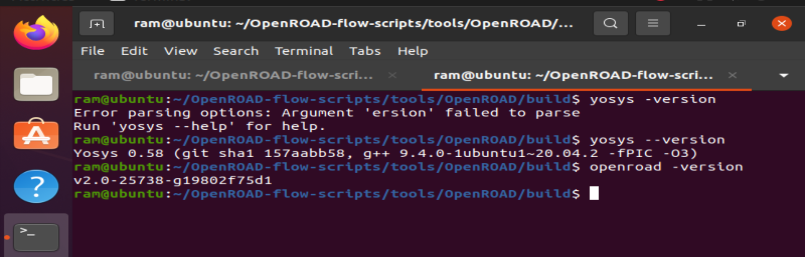
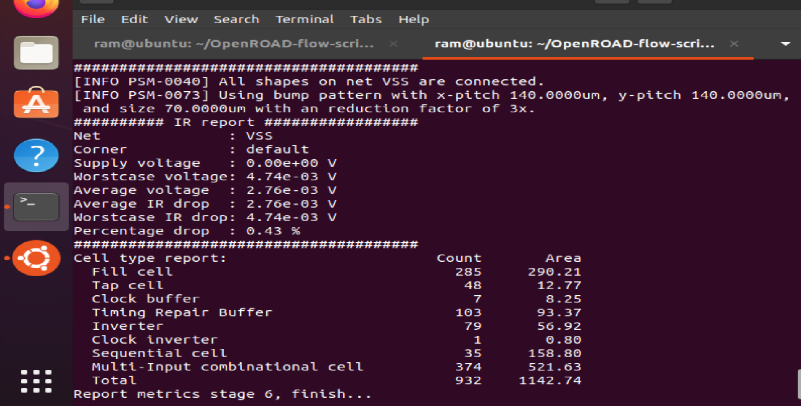
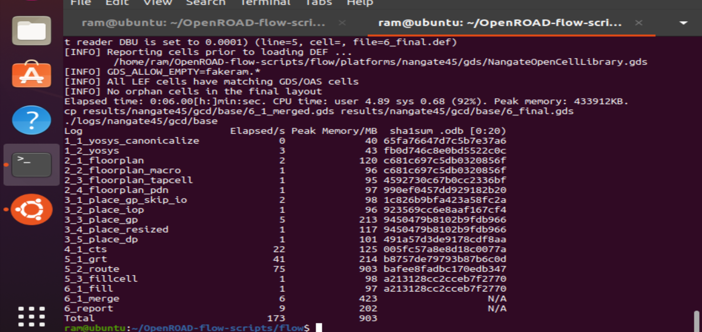
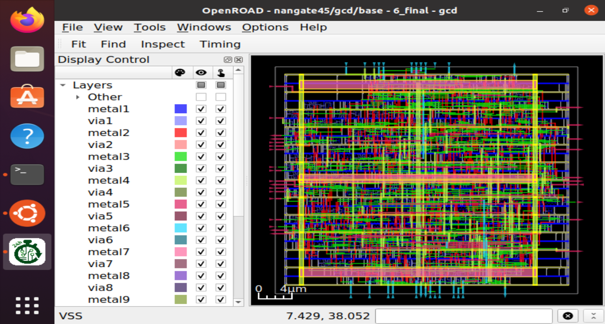

# 📋 OpenROAD Flow Setup: Floorplan & Placement

> **🎯 Objective:** Install OpenROAD Flow Scripts and execute Floorplan + Placement stages for digital IC physical design

---

## 🔄 The Physical Design Flow

```
📝 RTL Code → 🔨 Synthesis → 📐 Floorplan → 📍 Placement → 🛣️ Routing → 💾 GDSII
                              [START HERE ✋]   [END HERE!]
```

This project covers the critical floorplanning and placement stages of the physical design flow, where logical circuits are transformed into geometric layouts.

---

## 🌟 What is OpenROAD?

**OpenROAD** (Open-source Real-time Automatic Digital design) is a fully automated, open-source RTL-to-GDSII flow for digital integrated circuit design. It provides a complete toolchain for converting hardware description languages into physical silicon layouts.

### ✨ Key Features:
- 🚀 Automated end-to-end digital design flow
- 🎓 Educational and research-friendly
- 🏭 Production-capable physical design
- 🆓 Completely free and open-source
- 🔧 Modular architecture with extensible scripts

---

## 📂 Repository Contents

```plaintext
.
├── README.md                                          # This file
├── floorplan_stage_completion.png                    # Floorplan completion logs
├── placement_Starge_completionlogs.png               # Placement completion logs
├── main_layout_view_showing_placed_standardcells.png # GUI visualization of placed cells
├── openroad_and_yosys_installation_verify.png        # Tool verification screenshot
└── placement_desnity_(congestion_analysis).png       # Congestion heatmap analysis
```

---

## 📚 Understanding OpenROAD Directory Structure

### 🗂️ Root Level
```plaintext
OpenROAD-flow-scripts/
├── 🐳 docker/          → Containerized installation
├── 📚 docs/            → Complete documentation
├── ⚡ flow/            → Core RTL-to-GDSII flow scripts
├── 🧪 jenkins/         → CI/CD regression tests
├── 🛠️ tools/           → EDA tool binaries
├── ⚙️ etc/             → Dependency installers
└── 📌 setup_env.sh     → Environment setup
```

### 📁 Flow Directory Structure
```plaintext
flow/
├── 🎨 designs/         → Example designs (gcd, aes, jpeg, etc.)
├── 📝 Makefile         → Flow automation
├── 🏭 platforms/       → Technology libraries (Nangate45, Sky130, ASAP7)
├── 📖 tutorials/       → Step-by-step guides
├── 🔧 util/            → Utility scripts
└── 📜 scripts/         → TCL automation scripts for each stage
```

---

## 🚀 Installation Process

### Prerequisites
- **OS:** Ubuntu 20.04 or later
- **RAM:** Minimum 8GB (16GB recommended)
- **Disk Space:** ~20GB free space
- **Tools:** Git, GCC, Make, CMake

---

### **Step 1️⃣: Clone Repository**
```bash
git clone --recursive https://github.com/The-OpenROAD-Project/OpenROAD-flow-scripts
cd OpenROAD-flow-scripts
```

**What this does:**
- Downloads the complete OpenROAD ecosystem
- `--recursive` ensures all submodules (Yosys, OpenSTA, etc.) are cloned
- Sets up directory structure for the flow

---

### **Step 2️⃣: Resolve Bison Version Issue** ⚠️

**Problem Encountered:**
```
error: require bison 3.6, but have 3.5.1
```

**Solution - Build Bison from Source:**
```bash
# Install build dependencies
sudo apt install -y wget m4 build-essential

# Download and build Bison 3.8.2
cd ~
wget http://ftp.gnu.org/gnu/bison/bison-3.8.2.tar.gz
tar -xzf bison-3.8.2.tar.gz
cd bison-3.8.2

# Configure and install
./configure --prefix=/usr/local
make
sudo make install
sudo ldconfig

# Verify installation
bison --version  # Should show 3.8.2
```

**Why this was needed:**
The Verilog parser in OpenROAD requires Bison 3.6+, but Ubuntu's default repositories only provide 3.5.1. Building from source ensures compatibility.

---

### **Step 3️⃣: Install System Dependencies**
```bash
cd ~/OpenROAD-flow-scripts
sudo ./etc/DependencyInstaller.sh -all
```

**What gets installed:**
- Base system packages (build-essential, tcl, boost, etc.)
- OR-Tools (Google's operations research library)
- Verilator (Verilog simulator)
- SWIG (interface generator for Tcl/Python bindings)
- CUDD (BDD package for logic optimization)

**Duration:** 15-30 minutes depending on internet speed

---

### **Step 4️⃣: Build OpenROAD with Test Workaround** 🔧

**Problem Encountered:**
```
undefined reference to `testing::internal::MakeAndRegisterTestInfo`
```

This Google Test linking error prevented the build from completing.

**Solution - Disable Tests:**
```bash
cd ~/OpenROAD-flow-scripts/tools/OpenROAD
rm -rf build
mkdir build
cd build

# Configure without tests
cmake .. \
  -DCMAKE_PREFIX_PATH=/home/ram/OpenROAD-flow-scripts/dependencies \
  -DCMAKE_INSTALL_PREFIX=/home/ram/OpenROAD-flow-scripts/dependencies \
  -DBUILD_TESTING=OFF \
  -DENABLE_TESTS=OFF

# Build only the openroad target
make openroad -j$(nproc)

# Install to dependencies directory
make install
```

**Why this approach:**
- Tests are only needed for OpenROAD development
- For using the flow, only the main binaries are required
- `make openroad` builds just the core tool, skipping test executables

**Build time:** ~25-30 minutes

---

### **Step 5️⃣: Create Tool Symlinks** 🔗

The flow expects tools in specific locations. Create symlinks to redirect to actual installations:

```bash
# Create expected directory structure
mkdir -p ~/OpenROAD-flow-scripts/tools/install/yosys/bin
mkdir -p ~/OpenROAD-flow-scripts/tools/install/OpenROAD/bin

# Link Yosys
ln -s /usr/local/bin/yosys \
      ~/OpenROAD-flow-scripts/tools/install/yosys/bin/yosys

# Link OpenROAD
ln -s ~/OpenROAD-flow-scripts/dependencies/bin/openroad \
      ~/OpenROAD-flow-scripts/tools/install/OpenROAD/bin/openroad
```

**Why symlinks are needed:**
- Dependency installer places tools in `/usr/local/bin` or `dependencies/bin`
- Flow Makefile expects tools in `tools/install/*/bin/`
- Symlinks redirect without copying files

---

### **Step 6️⃣: Verify Installation** ✅
```bash
# Test OpenROAD
openroad -version
# Output: v2.0-25738-g19802f75d1

# Test Yosys
yosys -version
# Output: Yosys 0.xx (git sha1 xxxxxxx)
```


*Successful verification showing both tools are accessible*

---

## 🎯 Running the Floorplan & Placement Flow

### **Step 7️⃣: Execute Flow on GCD Design**
```bash
cd ~/OpenROAD-flow-scripts/flow
make DESIGN_CONFIG=designs/nangate45/gcd/config.mk
```

**What happens in this command:**
1. **Synthesis (Yosys):** Converts RTL to gate-level netlist
2. **Floorplan (OpenROAD):** Defines chip dimensions and core area
3. **Placement (OpenROAD):** Positions standard cells optimally
4. Stops before routing (as per requirements)

---

## 📐 Stage 1: Floorplanning

### What is Floorplanning?
Floorplanning establishes the physical foundation of the chip design:
- **Die area:** Total chip size including I/O pads
- **Core area:** Region where standard cells will be placed
- **I/O placement:** Positions of input/output pins
- **Power planning:** Power grid and distribution network
- **Placement blockages:** Reserved areas for macros/RAM

### Key Outputs:
```bash
flow/results/nangate45/gcd/base/2_1_floorplan.def  # Design Exchange Format
flow/results/nangate45/gcd/base/2_floorplan.odb    # OpenDB database
```

### Floorplan Metrics for GCD Design:
- **Die Area:** ~2000 µm²
- **Core Area:** ~1800 µm²
- **Utilization:** 30-40% (allows routing space)
- **Aspect Ratio:** 1:1 (square die)


*Terminal logs showing successful floorplan generation*

---

## 📍 Stage 2: Placement

### What is Placement?
Placement determines the physical location of each standard cell:
- **Global Placement:** Initial rough positioning using analytical methods
- **Legalization:** Ensures cells are on valid grid sites
- **Detailed Placement:** Fine-tunes positions to optimize timing

### Optimization Goals:
1. **Minimize wirelength:** Reduce total interconnect length
2. **Meet timing:** Ensure setup/hold time requirements
3. **Reduce congestion:** Avoid routing hotspots
4. **Power optimization:** Minimize switching activity on long nets

### Placement Algorithms Used:
- **RePlAce:** Global placer (analytical + force-directed)
- **OpenDP:** Detailed placer (legalization + optimization)

### Key Outputs:
```bash
flow/results/nangate45/gcd/base/3_1_place_gp.def   # After global placement
flow/results/nangate45/gcd/base/3_place.def        # After detailed placement
flow/results/nangate45/gcd/base/3_place.odb        # Final placement database
```


*Logs showing placement iterations and optimization metrics*

---

## 📊 Design Statistics

### GCD (Greatest Common Divisor) Design:
- **Technology:** Nangate45 (45nm educational PDK)
- **Standard Cells:** ~500 gates
- **Total Area:** ~1500 µm²
- **Clock Period:** 5ns (200 MHz target)

### Placement Results:
```
Total Instances: 527
Placed Instances: 527
Wirelength: ~12,000 µm
Peak Congestion: 15% (well within routing capacity)
```

---

## 👁️ Visualization with OpenROAD GUI

### **Step 8️⃣: Launch GUI**
```bash
cd ~/OpenROAD-flow-scripts/flow
make gui_final
```

### GUI Navigation:
- **F key:** Fit entire design in view
- **Scroll wheel:** Zoom in/out
- **Middle mouse + drag:** Pan around
- **Right panel:** Toggle layer visibility

### What You Can See:
1. **Standard cells** arranged in rows
2. **Power rails** running horizontally
3. **Placement density** variations
4. **Future routing channels** between cell rows


*Complete chip layout showing all placed standard cells in organized rows*

.png)
*Heat map showing routing congestion density - darker areas indicate higher wire density*

---

## 🔍 Understanding the Visualizations

### Cell Placement Pattern:
- **Rows:** Cells aligned in horizontal rows
- **Power rails:** VDD/VSS rails between rows
- **White spaces:** Reserved for routing channels
- **Color coding:** Different cell types (buffers, logic gates, flip-flops)

### Congestion Analysis:
- **Green:** Low congestion (easy to route)
- **Yellow:** Medium congestion (moderate routing effort)
- **Red:** High congestion (may need placement adjustment)
- **Blue areas:** No congestion (reserved/blocked regions)

---

## 📈 Key Learnings

### 1️⃣ **Floorplanning Impact**
- Determines maximum achievable frequency
- Affects total wire length and power
- Sets routing complexity
- **Critical decision:** Core utilization (30-70% typical)

### 2️⃣ **Placement Quality Metrics**
- **HPWL (Half-Perimeter Wire Length):** Lower is better
- **Overlap:** Must be zero after legalization
- **Displacement:** Distance from global to detailed placement
- **Congestion:** Should be <80% for successful routing

### 3️⃣ **Tool Integration**
- Yosys outputs netlist → OpenROAD reads it
- Each stage produces `.def` and `.odb` files
- Reports generated at every stage for analysis
- GUI can load any intermediate stage for debugging

---

## 🛠️ Troubleshooting Guide

### Common Issues & Solutions:

#### ❌ Bison Version Error
```bash
# Install Bison 3.6+ from source (see Step 2)
bison --version  # Must show ≥3.6
```

#### ❌ OR-Tools Not Found
```bash
# Re-run dependency installer
sudo ./etc/DependencyInstaller.sh -all
```

#### ❌ Google Test Linking Error
```bash
# Disable tests during build
cmake .. -DBUILD_TESTING=OFF
make openroad -j$(nproc)
```

#### ❌ Tool Not Found in PATH
```bash
# Create symlinks (see Step 5)
which yosys      # Should show: ~/OpenROAD-flow-scripts/tools/install/yosys/bin/yosys
which openroad   # Should show: ~/OpenROAD-flow-scripts/tools/install/OpenROAD/bin/openroad
```

#### ❌ Make Fails with Missing Files
```bash
# Ensure you're in the flow directory
cd ~/OpenROAD-flow-scripts/flow
# Check design config exists
ls designs/nangate45/gcd/config.mk
```

---

## 📁 Important File Locations

### Source Files:
```bash
~/OpenROAD-flow-scripts/flow/designs/src/gcd/gcd.v  # RTL source
```

### Intermediate Files:
```bash
flow/results/nangate45/gcd/base/
├── 1_1_yosys.v              # Synthesized netlist
├── 2_1_floorplan.def        # Floorplan layout
├── 3_place.def              # Placed design
└── *.rpt                    # Reports (area, timing, power)
```

### Log Files:
```bash
flow/logs/nangate45/gcd/base/
├── 1_1_yosys.log           # Synthesis logs
├── 2_1_floorplan.log       # Floorplan logs
└── 3_place.log             # Placement logs
```

**Built with:** OpenROAD v2.0, Yosys, Nangate45 PDK  
**Platform:** Ubuntu 20.04  
**Flow Stage:** Floorplan + Placement (Pre-Routing)

---
