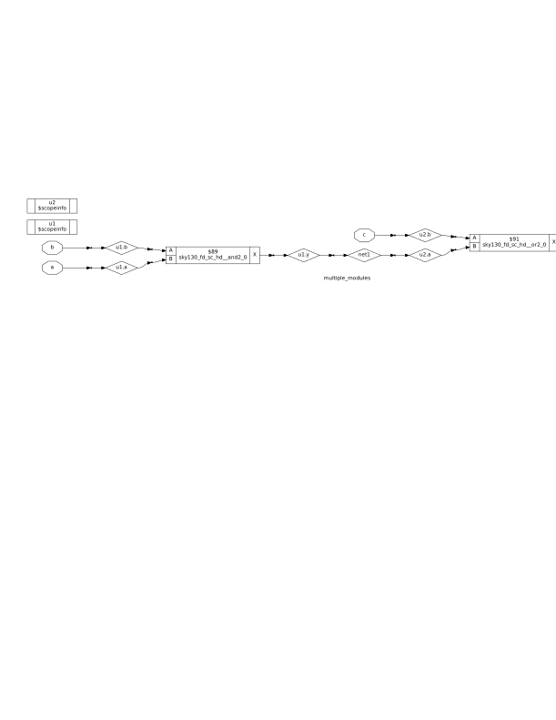

# Day 2: Timing Libraries, Synthesis Approaches, and Efficient Flip-Flop Coding

Welcome to Day 2 of the RTL Workshop. This day covers three crucial topics:
- Understanding the `.lib` timing library (sky130_fd_sc_hd__tt_025C_1v80.lib) used in open-source PDKs.
- Comparing hierarchical vs. flat synthesis methods.
- Exploring efficient coding styles for flip-flops in RTL design.

---

# Contents

- [Timing Libraries](#timing-libraries)
  - [SKY130 PDK Overview](#sky130-pdk-overview)
  - [Decoding tt_025C_1v80 in the SKY130 PDK](#decoding-tt_025c_1v80-in-the-sky130-pdk)
  - [Opening and Exploring the .lib File](#opening-and-exploring-the-lib-file)

- [Hierarchical vs. Flattened Synthesis](#hierarchical-vs-flattened-synthesis)
  - [Hierarchical Synthesis](#hierarchical-synthesis)
  - [Flattened Synthesis](#flattened-synthesis)
  - [Key Differences](#key-differences)

- [Flip-Flop Coding Styles](#flip-flop-coding-styles)
  - [Asynchronous Reset D Flip-Flop](#asynchronous-reset-d-flip-flop)
  - [Asynchronous Set D Flip-Flop](#asynchronous-set-d-flip-flop)
  - [Synchronous Reset D Flip-Flop](#synchronous-reset-d-flip-flop)
  - [Asynchronous Reset and Synchronous Reset D Flip-Flop](#asynchronous-reset-and-synchronous-reset-d-flip-flop)

- [Simulation and Synthesis Workflow](#simulation-and-synthesis-workflow)
  - [Icarus Verilog Simulation](#icarus-verilog-simulation)
  - [Synthesis with Yosys](#synthesis-with-yosys)

- [Files in this Directory](#files-in-this-directory)

---

## Timing Libraries

### SKY130 PDK Overview

The SKY130 PDK is an open-source Process Design Kit based on SkyWater Technology's 130nm CMOS technology. It provides essential models and libraries for integrated circuit (IC) design, including timing, power, and process variation information.


### Decoding tt_025C_1v80 in the SKY130 PDK

- **tt**: Typical process corner.
- **025C**: Represents a temperature of 25°C, relevant for temperature-dependent performance.
- **1v80**: Indicates a core voltage of 1.8V.

This naming convention clarifies which process, voltage, and temperature conditions the library models.

### Opening and Exploring the .lib File

To open the sky130_fd_sc_hd__tt_025C_1v80.lib file:

1. **Install a text editor:**
   ```shell
   sudo apt install gedit
   ```

2. **Open the file:**
   ```shell
   gedit sky130_fd_sc_hd__tt_025C_1v80.lib
   ```

The library contains timing information for all standard cells in the technology library, including setup time, hold time, and propagation delays.

---

## Hierarchical vs. Flattened Synthesis

### Understanding Sub-module Synthesis

When working with complex designs, synthesis tools can handle modules in different ways. The choice between synthesizing individual sub-modules versus the entire design impacts optimization, debugging, and design flow.


### Hierarchical Synthesis

- **Definition**: Retains the module hierarchy as defined in RTL, synthesizing modules separately.
- **How it Works**: Tools like Yosys process each module independently, using commands such as `hierarchy` to analyze and set up the design structure.

**Advantages:**
- Faster synthesis time for large designs.
- Improved debugging and analysis due to maintained module boundaries.
- Modular approach, aiding integration with other tools.

**Disadvantages:**
- Cross-module optimizations are limited.
- Reporting can require additional configuration.

**Example:** See `multiple_modules_heir.v` for hierarchical synthesis output.


### Flattened Synthesis

- **Definition**: Merges all modules into a single flat netlist, eliminating hierarchy.
- **How it Works**: The `flatten` command in Yosys collapses the hierarchy, allowing whole-design optimizations.

**Advantages:**
- Enables aggressive, cross-module optimizations.
- Results in a unified netlist, sometimes simplifying downstream processes.

**Disadvantages:**
- Longer runtime for large designs.
- Loss of hierarchy complicates debugging and reporting.
- Can increase memory usage and netlist complexity.

**Example:** See `multiple_modules_flat.v` for flattened synthesis output.


> **Important:** Hierarchical synthesis maintains sub-modules in the design, while flattening produces a netlist from the ground up.

### Key Differences

| Aspect                | Hierarchical Synthesis             | Flattened Synthesis           |
|-----------------------|------------------------------------|------------------------------|
| Hierarchy             | Preserved                          | Collapsed                    |
| Optimization Scope    | Module-level only                  | Whole-design                 |
| Runtime               | Faster for large designs           | Slower for large designs     |
| Debugging             | Easier (traces to RTL)             | Harder                       |
| Output Complexity     | Modular structure                  | Single, complex netlist      |
| Use Case              | Modularity, analysis, reporting    | Maximum optimization         |

---

## Flip-Flop Coding Styles

Flip-flops are fundamental sequential elements in digital design, used to store binary data. Below are efficient coding styles for different reset/set behaviors.

### Asynchronous Reset D Flip-Flop

**File:** `asyncres_dff.v`

```verilog
module dff_asyncres (input clk, input async_reset, input d, output reg q);
  always @ (posedge clk, posedge async_reset)
    if (async_reset)
      q <= 1'b0;
    else
      q <= d;
endmodule
```
- **Asynchronous reset**: Overrides clock, setting q to 0 immediately.
- **Edge-triggered**: Captures d on rising clock edge if reset is low.

### Asynchronous Set D Flip-Flop

**File:** `asyncset_dff.v`

```verilog
module dff_async_set (input clk, input async_set, input d, output reg q);
  always @ (posedge clk, posedge async_set)
    if (async_set)
      q <= 1'b1;
    else
      q <= d;
endmodule
```
- **Asynchronous set**: Overrides clock, setting q to 1 immediately.

### Synchronous Reset D Flip-Flop

**File:** `dff_syncres.v`

```verilog
module dff_syncres (input clk, input sync_reset, input d, output reg q);
  always @ (posedge clk)
    if (sync_reset)
      q <= 1'b0;
    else
      q <= d;
endmodule
```
- **Synchronous reset**: Takes effect only on the clock edge.


### Asynchronous Reset and Synchronous Reset D Flip-Flop

**File:** `asyncres_syncres.v`

```verilog
module dff_asyncres_syncres (input clk, input async_reset, input sync_res, input d, output reg q);
  always @ (posedge clk, posedge async_reset)
    if (async_reset)
      q <= 1'b0;
    else if (sync_reset)
      q <= 1'b0;
    else
      q <= d;
endmodule
```
- **Hybrid approach**: Combines both asynchronous and synchronous reset capabilities.

---

## Simulation and Synthesis Workflow

### Icarus Verilog Simulation

1. **Compile:**
   ```shell
   iverilog dff_asyncres.v tb_dff_asyncres.v
   ```

2. **Run:**
   ```shell
   ./a.out
   ```

3. **View Waveform:**
   ```shell
   gtkwave tb_dff_asyncres.vcd
   ```


### Synthesis with Yosys

1. **Start Yosys:**
   ```shell
   yosys
   ```

2. **Read Liberty library:**
   ```shell
   read_liberty -lib /address/to/your/sky130/file/sky130_fd_sc_hd__tt_025C_1v80.lib
   ```

3. **Read Verilog code:**
   ```shell
   read_verilog /path/to/dff_asyncres.v
   ```

4. **Synthesize:**
   ```shell
   synth -top dff_asyncres
   ```

5. **Map flip-flops:**
   ```shell
   dfflibmap -liberty /address/to/your/sky130/file/sky130_fd_sc_hd__tt_025C_1v80.lib
   ```

6. **Technology mapping:**
   ```shell
   abc -liberty /address/to/your/sky130/file/sky130_fd_sc_hd__tt_025C_1v80.lib
   ```

7. **Visualize the gate-level netlist:**
   ```shell
   show
   ```

For more detailed netlist visualization, see the SVG output:




---

## Files in this Directory

### Verilog Source Files
- **`asyncres_dff.v`**: Asynchronous reset D flip-flop implementation
- **`asyncset_dff.v`**: Asynchronous set D flip-flop implementation  
- **`dff_syncres.v`**: Synchronous reset D flip-flop implementation
- **`asyncres_syncres.v`**: Hybrid asynchronous and synchronous reset D flip-flop
- **`multiple_modules.v`**: Example design with multiple sub-modules

### Synthesized Netlists
- **`multiple_modules_heir.v`**: Hierarchical synthesis output preserving module boundaries
- **`multiple_modules_flat.v`**: Flattened synthesis output with collapsed hierarchy

### Documentation and Visual Aids
- **`notes.txt`**: Additional notes on PVT variations and synthesis approaches
- **`output.svg`**: Schematic diagram of synthesized netlist
- **`ss-dff_async.png`**: Screenshot of asynchronous flip-flop simulation waveforms
- **`ss-dff_asyncres_syntehsized_netlist_mapped.png`**: Screenshot of synthesized netlist mapping
- **`ss-dff_syncres.png`**: Screenshot of synchronous reset flip-flop waveforms
- **`PDK_overview.png`**: Overview of SKY130 PDK structure and components
- **`heirarchial_structure.png`**: Hierarchical synthesis structure visualization
- **`flattened_strcture_multiple_modules.png`**: Flattened synthesis structure visualization
- **`multiple_modules_syntheszied_verilog_hierarchial.png`**: Hierarchical synthesis Verilog output
- **`synthesize_sub_module_of_a_module.png`**: Sub-module synthesis approach

---

## Summary

This workshop day provides practical insights into timing libraries, synthesis strategies, and reliable coding practices for flip-flops. The provided Verilog files demonstrate different flip-flop implementations, while the synthesis outputs show the impact of hierarchical versus flattened approaches. Continue experimenting with these concepts to deepen your understanding of RTL design and synthesis.

### Key Takeaways

1. **Library Understanding**: The SKY130 PDK provides comprehensive timing models for 130nm CMOS technology
2. **Synthesis Trade-offs**: Choose between hierarchical (faster, modular) and flattened (optimized) synthesis based on design requirements
3. **Reset Strategies**: Select appropriate reset mechanisms (async, sync, or hybrid) based on timing requirements and design constraints
4. **Verification Importance**: Always simulate before synthesis and verify synthesized netlists match expected behavior