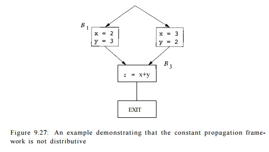
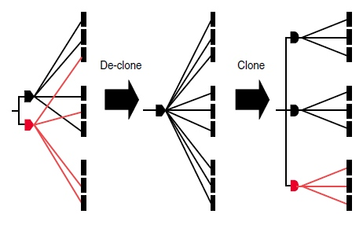
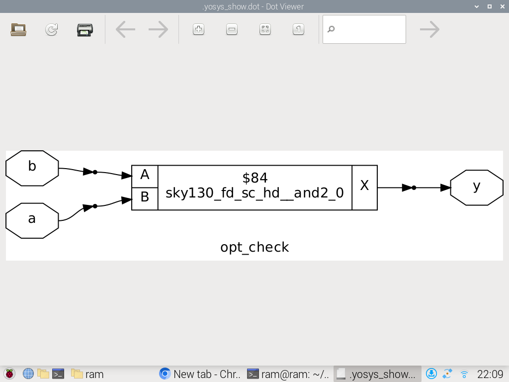
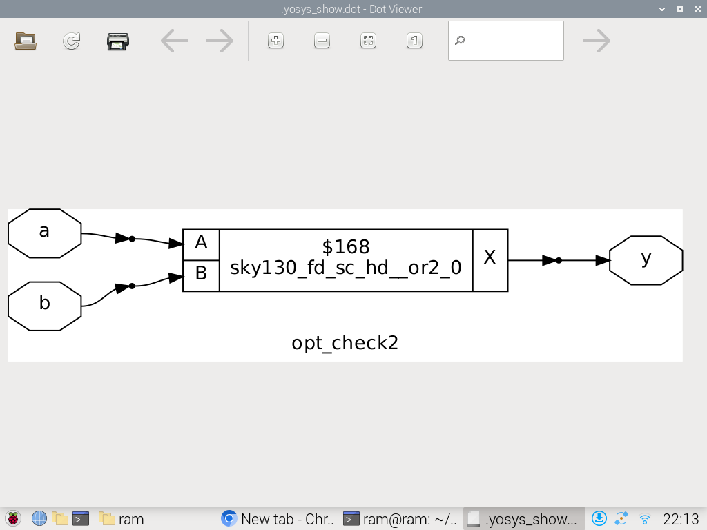
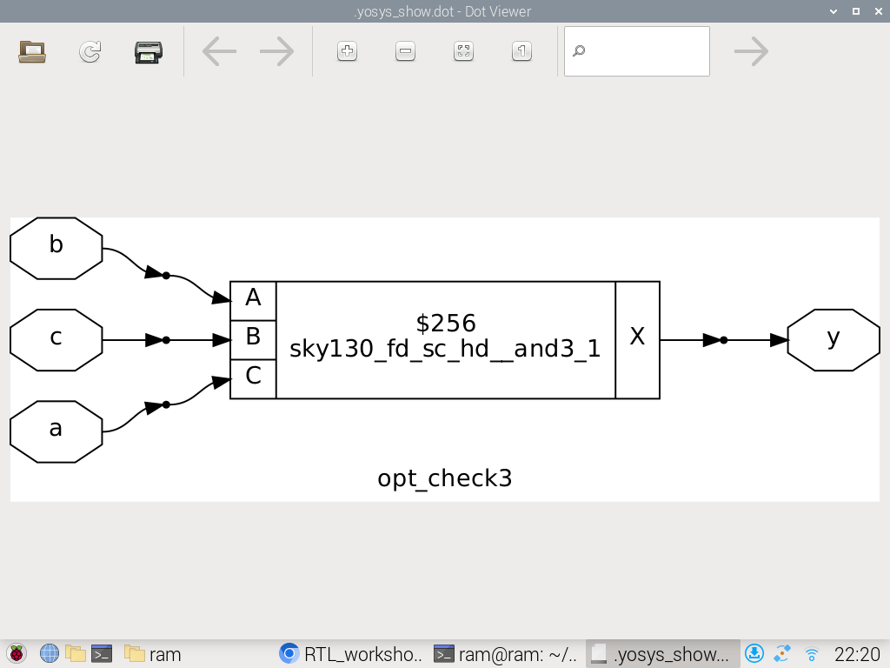
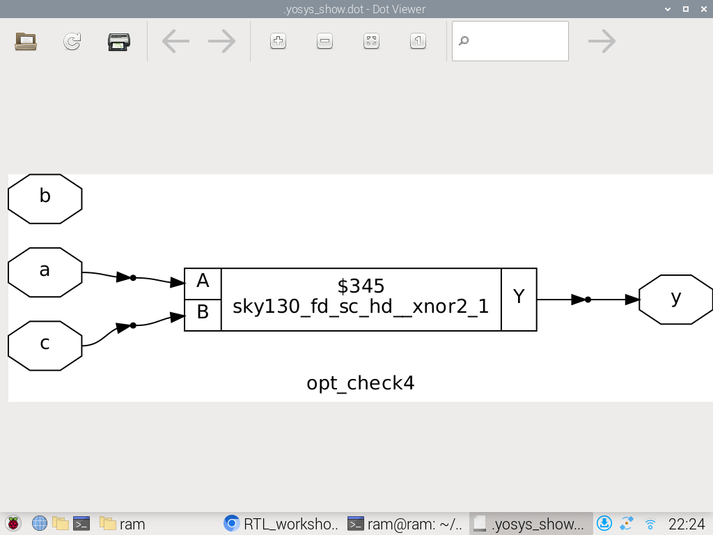
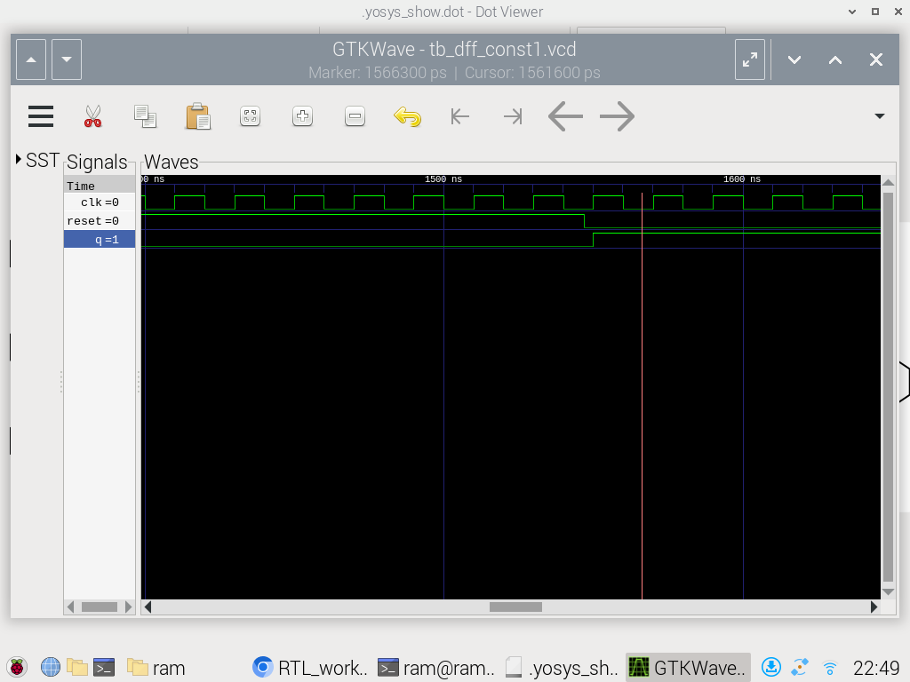
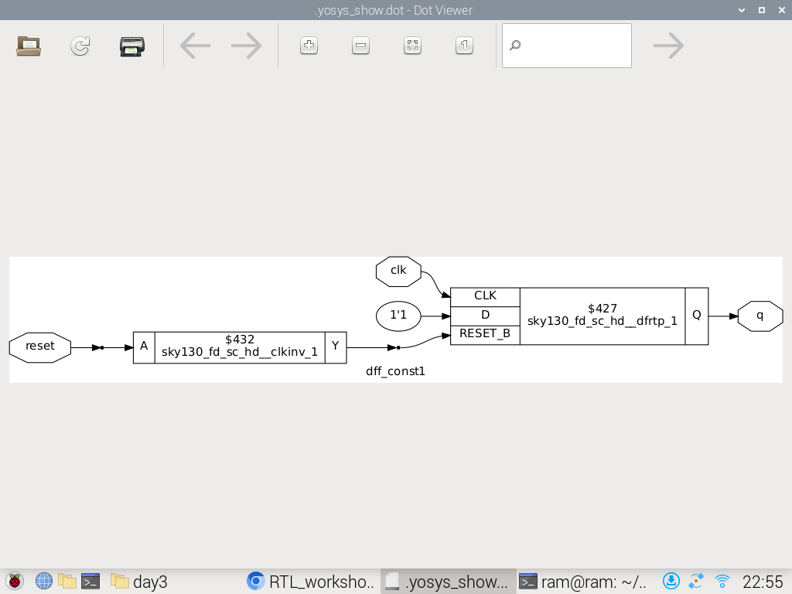
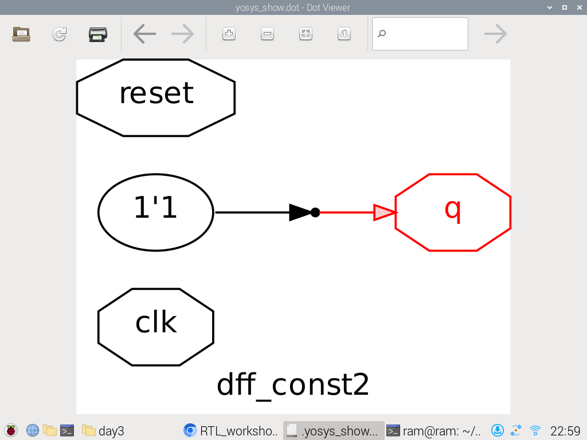

# Day 3: Combinational and Sequential Optimization

Welcome to Day 3 of this workshop! Today we discuss optimization of combinational and sequential circuits, introducing techniques to enhance efficiency and performance.

---

## Table of Contents

- [1. Constant Propagation](#1-constant-propagation)
- [2. State Optimization](#2-state-optimization)
- [3. Cloning](#3-cloning)
- [4. Retiming](#4-retiming)
- [5. Labs on Optimization](#5-labs-on-optimization)
  - [Lab 1](#lab-1)
  - [Lab 2](#lab-2)
  - [Lab 3](#lab-3)
  - [Lab 4](#lab-4)
  - [Lab 5](#lab-5)
  - [Lab 6](#lab-6)

---

## 1. Constant Propagation

In VLSI design, constant propagation is a compiler optimization technique used to replace variables with their constant values during synthesis. This can simplify design and enhance performance.

**How it works:**  
Constant propagation analyzes the design code to identify variables with constant values. These are replaced directly, allowing tools to simplify logic and reduce circuit size.

**Benefits:**
- **Reduced Complexity:** Simpler logic, smaller circuit.
- **Performance Improvement:** Faster execution and reduced delays.
- **Resource Optimization:** Fewer gates or flip-flops required.



---

## 2. State Optimization

State optimization refines finite state machines (FSMs) to improve efficiency in IC design. It reduces the number of states, optimizes encoding, and minimizes logic.

**How it is done:**
- **State Reduction:** Merge equivalent states using algorithms.
- **State Encoding:** Assign optimal codes to states.
- **Logic Minimization:** Use Boolean algebra or tools for compact equations.
- **Power Optimization:** Techniques like clock gating reduce dynamic power.

---

## 3. Cloning

Cloning duplicates a logic cell or module to optimize performance, reduce power, or improve timing by balancing load or reducing wire length.

**How it's done:**
- Identify critical paths using analysis tools.
- Duplicate the target cell/module.
- Redistribute connections to balance load.
- Place and route the cloned cell.
- Verify improvement via timing and power analysis.



---

## 4. Retiming

Retiming is a design optimization technique that improves circuit performance by repositioning registers (flip-flops) without changing functionality.

**How it is done:**
1. **Graph Representation:** Model circuit as a directed graph.
2. **Register Repositioning:** Move registers to balance path delays.
3. **Constraints Analysis:** Maintain timing and functional equivalence.
4. **Optimization:** Adjust register positions to minimize clock period and optimize power.

---

## 5. Labs on Optimization

### Lab 1

Below is the Verilog code for Lab 1:

```verilog
module opt_check (input a , input b , output y);
	assign y = a?b:0;
endmodule
```

**Explanation:**
- `assign y = a ? b : 0;` means:
  - If `a` is true, `y` is assigned the value of `b`.
  - If `a` is false, `y` is 0.

Follow the synthesis steps and add the following between `abc -liberty` and `synth -top`:

```shell
opt_clean -purge
```



---

### Lab 2

Verilog code:

```verilog
module opt_check2 (input a , input b , output y);
	assign y = a?1:b;
endmodule
```

**Code Analysis:**
- Acts as a multiplexer:
  - `y = 1` if `a` is true.
  - `y = b` if `a` is false.



---

### Lab 3

Verilog code:

```verilog
module opt_check3 (input a , input b , input c , output y);
	assign y = a?(b?c:0):0;
endmodule
```

**Functionality:**  
Three-input logic gate that simplifies to a 3-input AND gate through optimization.



---

### Lab 4

Verilog code:

```verilog
module opt_check4 (input a , input b , input c , output y);
 assign y = a?(b?(a & c ):c):(!c);
 endmodule
```

**Functionality:**
- Three inputs (`a`, `b`, `c`), output `y`.
- Nested ternary logic that optimizes to XNOR functionality.
- Logic simplifies through Boolean optimization.



---

### Lab 5

Verilog code:

```verilog
module dff_const1(input clk, input reset, output reg q);
always @(posedge clk, posedge reset)
begin
	if(reset)
		q <= 1'b0;
	else
		q <= 1'b1;
endmodule
```

**Functionality:**
- D flip-flop with:
  - Asynchronous reset to 0
  - Loads constant `1` when not in reset

**Simulation Output:**


**Synthesized Result:**


---

### Lab 6

Verilog code:

```verilog
module dff_const2(input clk, input reset, output reg q);
always @(posedge clk, posedge reset)
begin
	if(reset)
		q <= 1'b1;
	else
		q <= 1'b1;
endmodule
```

**Functionality:**
- D flip-flop always sets output `q` to `1` (regardless of reset or clock).
- This gets optimized to a constant `1` output.

**Simulation Output:**


**Synthesized Result:**


---

## Summary

- **Focus:** Optimization techniques for combinational and sequential circuits in digital design, with practical Verilog labs.
  
- **Topics Covered:**
  1. **Constant Propagation:** Replacing variables with constant values to simplify logic and improve circuit efficiency.
  2. **State Optimization:** Reducing states and optimizing encoding in finite state machines to use less logic and power.
  3. **Cloning:** Duplicating logic cells/modules to improve timing and balance load.
  4. **Retiming:** Repositioning registers in a circuit to enhance performance without altering its function.

- **Labs:** Six practical Verilog labs illustrate these concepts, including examples of combinational logic optimizations and D flip-flop behaviors, each with code snippets and output images.
