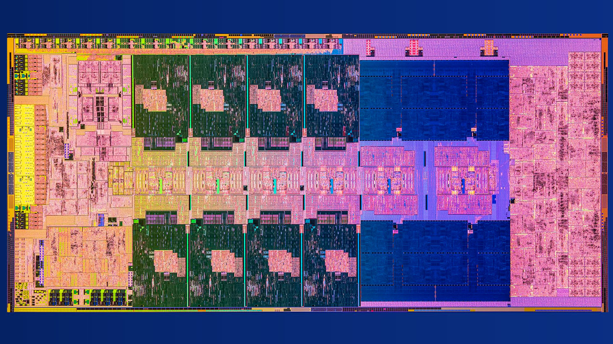
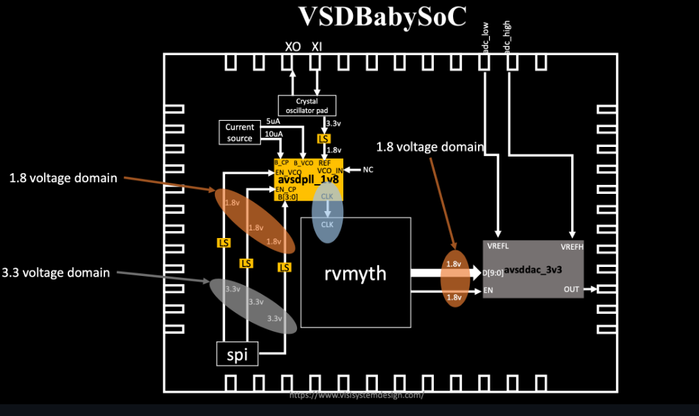
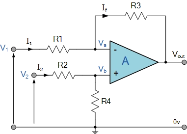

# Understanding SoC Design Fundamentals Through VSDBabySoC

## What is a System-on-Chip (SoC)?

A System-on-Chip (SoC) integrates all necessary electronic components and subsystems of a computer or electronic system onto a single integrated circuit. Rather than assembling discrete chips on a circuit board, an SoC combines processing, memory, peripherals, and interfaces in one package.


*Modern processors integrate CPU cores, GPU, memory controllers, and I/O in a single package*

This integration approach represents a fundamental shift from traditional multi-chip systems. Consider a smartphone: instead of separate chips for the processor, graphics, modem, Wi-Fi, Bluetooth, and sensors connected via a circuit board, a modern smartphone SoC incorporates all these functions on a single piece of silicon. This consolidation delivers transformative advantages:

**Size and Integration Benefits**: All components on one die dramatically reduce the physical footprint compared to multiple discrete chips. What once required a full circuit board now fits in a package smaller than a fingernail.

**Power Efficiency**: Shorter interconnects between components reduce capacitance and switching power. On-chip communication consumes orders of magnitude less energy than sending signals across board traces and through package pins.

**Performance Improvements**: Tighter coupling between components enables faster communication with lower latency. Data transfers that might take nanoseconds across a board happen in picoseconds on-chip.

**Cost Reduction**: Fewer components mean simpler board design, lower assembly costs, and reduced testing complexity. While the SoC itself may be expensive to design, per-unit manufacturing costs decrease significantly.

**Enhanced Reliability**: Fewer solder joints and connectors reduce potential failure points. On-chip interconnects are more robust than board-level connections subject to thermal stress and mechanical vibration.

## Components of a Typical SoC

A complete SoC architecture comprises several fundamental subsystems that work in concert to deliver system functionality:

### 1. Processing Units

The computational heart of any SoC consists of one or more processing elements:

**CPU Cores** execute program instructions, ranging from simple microcontrollers running at tens of MHz to sophisticated multi-core processors operating at several GHz. Modern SoCs often employ heterogeneous architectures mixing high-performance and energy-efficient cores.

**GPU (Graphics Processing Unit)** handles graphics rendering and increasingly, general-purpose parallel computations. The massively parallel architecture excels at processing large datasets simultaneously.

**DSP (Digital Signal Processor)** specializes in signal processing tasks like audio encoding/decoding, image processing, and communications protocols. Optimized architectures deliver better performance-per-watt than general-purpose CPUs for these workloads.

**Specialized Accelerators** tackle domain-specific tasks: neural network accelerators for AI inference, cryptographic engines for security operations, video encoders/decoders, and more. These fixed-function blocks offer orders of magnitude better efficiency than software implementations.

### 2. Memory Subsystem

Memory architecture profoundly impacts system performance and power consumption:

**On-chip Cache** provides fast storage close to the processor, typically organized in multiple levels (L1, L2, L3). Cache hit rates dramatically affect overall system performance.

**Memory Controllers** interface with external DRAM (DDR4, DDR5, LPDDR), managing complex protocols for refresh, timing, and power states. Modern controllers implement features like error correction and bandwidth optimization.

**ROM (Read-Only Memory)** stores boot code and firmware that must survive power cycles. Often implemented as one-time programmable or masked ROM for security.

**Flash Storage** provides non-volatile storage for operating systems, applications, and user data. Modern SoCs integrate flash controllers supporting protocols like eMMC or UFS.

### 3. Interconnect Fabric

The communication infrastructure connecting all components determines how efficiently they can exchange data:

**Bus Systems** like AHB (Advanced High-performance Bus), AXI (Advanced eXtensible Interface), and Wishbone define standardized protocols for component communication. These specifications ensure interoperability and simplify integration.

**Arbitration Logic** manages access when multiple components attempt to use shared resources simultaneously. Sophisticated schemes balance fairness, priority, and latency requirements.

**Clock Distribution Networks** deliver synchronized timing signals across the chip. Careful design minimizes skew (timing differences) between distant components while managing power consumption.

**Network-on-Chip (NoC)** architectures scale to dozens or hundreds of components by implementing packet-switched routing rather than shared buses. This approach offers better scalability and power efficiency for large SoCs.

### 4. Peripheral Interfaces

SoCs interact with the external world through diverse interface standards:

**GPIO (General Purpose Input/Output)** provides configurable digital pins for simple sensors, LEDs, buttons, and control signals.

**Serial Protocols** enable communication with external devices: UART for simple asynchronous serial, SPI for high-speed synchronous transfers, I2C for multi-drop sensor networks.

**High-Speed Interfaces** like USB, PCIe, and Ethernet handle data-intensive connections to storage, networking, and peripheral devices.

**Analog Interfaces** bridge digital and analog domains: ADCs (Analog-to-Digital Converters) sample analog signals like sensor outputs or audio, while DACs (Digital-to-Analog Converters) generate analog outputs for speakers, displays, or control systems.

### 5. Clock and Power Management

Efficient operation requires sophisticated control of timing and energy:

**Clock Generation** typically employs Phase-Locked Loops (PLLs) to synthesize multiple frequencies from a single crystal reference. Different subsystems often require different clock rates optimized for their function.

**Voltage Regulation** generates required supply voltages from battery or external power. Modern SoCs use multiple voltage domains, allowing critical paths to run at higher voltages while peripheral logic operates at lower voltages for efficiency.

**Clock Gating** disables clock signals to unused logic blocks, eliminating dynamic power consumption without losing state. Fine-grained clock gating can save significant power in real-world workloads.

**Power Domains** allow entire subsystems to be powered down completely when not needed. Advanced techniques like retention mode preserve critical state while shutting down most circuitry.

**Dynamic Voltage and Frequency Scaling (DVFS)** adjusts operating points based on workload demands, trading performance for power consumption as needed.

## VSDBabySoC: A Simplified Learning Model



VSDBabySoC distills these complex SoC concepts into a minimal yet complete system featuring three carefully selected components. This deliberate simplification makes advanced concepts accessible while demonstrating real mixed-signal integration challenges.

### System Architecture

```
                    ┌─────────────────────────────────┐
                    │      VSDBabySoC System          │
                    │                                 │
   Reference   ──▶  │  ┌───────────────────┐         │
     Clock          │  │   Phase-Locked    │         │
                    │  │   Loop (PLL)      │         │
                    │  │   8x Multiplier   │         │
                    │  └─────────┬─────────┘         │
                    │            │ System Clock      │
                    │            ▼                   │
                    │  ┌───────────────────┐         │
                    │  │   RVMYTH Core     │         │
                    │  │   RISC-V CPU      │         │
                    │  │   (32-bit)        │         │
                    │  └─────────┬─────────┘         │
                    │            │ r17[9:0]          │
                    │            ▼                   │
                    │  ┌───────────────────┐         │
                    │  │   10-bit DAC      │         │  Analog
                    │  │   R-2R Ladder     │  ─────▶ │  Output
                    │  └───────────────────┘         │  Signal
                    │                                 │
                    └─────────────────────────────────┘
```

### Component Deep Dive

#### RVMYTH - The Processing Core

RVMYTH implements a subset of the RISC-V RV32I instruction set, providing a functional 32-bit processor that demonstrates fundamental CPU concepts. Unlike abstract processor models, RVMYTH is a real, synthesizable core capable of executing standard RISC-V programs.

The architecture features a multi-stage pipeline with hazard detection, 32 general-purpose registers following the RISC-V specification, and a dedicated output interface through register r17 for DAC data. This specific configuration teaches several crucial concepts:

**Instruction Execution**: Students can trace how RISC-V instructions (arithmetic, logical, load/store, branches) flow through the pipeline and produce results.

**Register File Design**: The 32-register architecture demonstrates how processors maintain working state and handle data dependencies.

**I/O Interfacing**: Using register r17 as a dedicated output shows one approach to peripheral interfacing—a concept applicable to any SoC design.

**Synthesis Considerations**: The fully synthesizable Verilog implementation reveals how abstract hardware descriptions translate to actual logic gates.

The small footprint and clear structure make RVMYTH ideal for understanding processor internals without the overwhelming complexity of commercial cores with out-of-order execution, branch prediction, and multiple issue pipelines.

#### Phase-Locked Loop (PLL) - Clock Generation


The PLL represents one of the most critical yet often overlooked aspects of SoC design. This analog/mixed-signal block generates the stable, high-frequency clock that synchronizes all digital operations.

**Why On-Chip PLLs are Essential:**

Traditional approaches using external crystal oscillators face fundamental limitations in modern SoCs. Propagation delay causes clock signals to arrive at different times across the chip, creating skew that can violate timing constraints. Long clock distribution networks couple noise from switching logic, introducing jitter—random variations in clock edge timing. Different subsystems often require different frequencies: perhaps the CPU runs at 1 GHz while peripherals operate at 100 MHz. Without on-chip frequency synthesis, the design would need multiple crystals and complex distribution.

Furthermore, crystal oscillators have inherent frequency tolerance (typically ±50 ppm) and drift with temperature. While acceptable for some applications, precision timing like USB communication requires much tighter accuracy. A PLL can clean up and stabilize the reference signal while multiplying it to the required frequency.

**PLL Architecture:**

BabySoC's PLL implements the classic four-block architecture:

The **Phase Frequency Detector (PFD)** compares the reference clock phase with the divided feedback signal, generating error pulses proportional to the phase difference. Operating on both rising and falling edges enables faster lock acquisition.

The **Charge Pump** converts digital error pulses into an analog control voltage. This critical component determines loop dynamics—how quickly the PLL locks and how much jitter it exhibits. Filtering high-frequency components ensures stable operation.

The **Voltage-Controlled Oscillator (VCO)** generates the output clock at a frequency proportional to the control voltage. In this design, it provides 8x frequency multiplication, transforming a modest reference frequency into the high-speed system clock.

The **Frequency Divider** divides the VCO output by 8 for feedback to the PFD, closing the control loop. At lock, the divided output matches the reference in both frequency and phase, ensuring the VCO runs at exactly 8× the reference frequency.

This continuous feedback mechanism automatically compensates for process variations, temperature changes, and voltage fluctuations—demonstrating adaptive control principles fundamental to analog design.

#### 10-bit Digital-to-Analog Converter (DAC) - Mixed-Signal Interface

The DAC bridges the digital and analog worlds, converting processor output into continuous voltages suitable for real-world interfacing. This component makes the SoC's operation tangible—you can measure the analog output with an oscilloscope and see the processor's computation directly.

**Architecture Choice: R-2R Ladder**



BabySoC employs an R-2R resistor ladder rather than binary-weighted resistors for compelling reasons. A binary-weighted design requires resistor values spanning a wide range (R, 2R, 4R, 8R... up to 512R for 10 bits), making accurate matching extremely difficult in IC manufacturing. Even 1% resistor variations cause significant conversion errors.

The R-2R ladder elegantly solves this by using only two resistor values in a repeating network structure. Current division at each node creates binary-weighted contributions, but the narrow value range (only R and 2R) enables much better matching in silicon. This architecture scales gracefully to any resolution—adding more bits simply extends the ladder.

**Operation:**

Each bit controls a switch connecting its ladder node to either the reference voltage (bit=1) or ground (bit=0). The ladder performs binary-weighted current division, producing an output voltage:

```
V_out = V_ref × (Digital_Input / 1024)
```

With 10-bit resolution, the system can produce 1024 distinct output levels. For example, digital input 0000000000 (0 decimal) generates 0V output, while 1111111111 (1023 decimal) produces approximately V_ref. Input 1000000000 (512 decimal) yields V_ref/2, demonstrating the linear transfer function.

**Mixed-Signal Integration Challenges:**

The DAC introduces real-world design considerations often absent from purely digital projects. Digital switching creates noise on power supplies that couples into sensitive analog circuits. The design must carefully isolate analog and digital grounds while maintaining a common reference. Reference voltage stability directly impacts conversion accuracy—any ripple or drift appears in the output. Layout becomes critical, as mismatched resistors or parasitic capacitance degrades performance.

These challenges mirror those in any mixed-signal SoC, from audio codecs to sensor interfaces. Understanding them through BabySoC's tangible example builds intuition applicable to much more complex designs.

### Why This Specific Architecture?

BabySoC's three-component design deliberately focuses learning on fundamental concepts:

**Complete Data Flow**: Information flows clearly from processor through DAC to analog output. There are no abstraction layers hiding the connections—you can trace every signal.

**Multiple Design Domains**: The system spans digital (RVMYTH), analog (PLL, DAC), and mixed-signal design, exposing students to the interdisciplinary nature of real SoC work.

**Measurable Outputs**: Unlike purely digital designs verified only through simulation, BabySoC produces analog voltages you can measure with test equipment. This tangible result reinforces understanding.

**Manageable Complexity**: With just three blocks, students can understand every interface, every signal, and every design decision without overwhelming complexity.

**Extensibility**: The modular architecture supports additions—memory interfaces, additional peripherals, or different DAC architectures—allowing incremental learning.

**Open-Source Foundation**: Built entirely on open-source tools (Sky130 PDK) and IP cores, BabySoC eliminates licensing barriers and allows complete design visibility.

What BabySoC intentionally omits is equally important: there's no memory subsystem (no caches, no external DRAM controller), no complex interconnect fabric (just direct connections), and limited peripherals (only the essential DAC). These omissions aren't limitations but features—they maintain focus on core concepts without distraction.

## The Role of Functional Modeling in SoC Design

Before committing resources to detailed RTL implementation and physical design, functional modeling serves as a crucial validation step. This stage occupies a critical position in the design flow, bridging architectural concepts and implementation reality.

### Design Flow Progression

The complete SoC development process follows a well-established sequence:

**1. Architectural Specification** begins with system requirements: What must the SoC do? What performance targets must it meet? What interfaces does it need? Designers select appropriate IP cores, define component interactions, and establish design constraints.

**2. Functional Modeling** creates high-level behavioral descriptions focusing on what the system does rather than how it's implemented. Models might use C++, SystemC, Python, or even MATLAB—languages enabling rapid iteration and algorithm development.

**3. RTL Design** translates functional models into synthesizable hardware descriptions in Verilog or VHDL. This stage adds implementation details: finite state machines, data paths, timing constraints, and synthesis directives.

**4. Verification** ensures the RTL correctly implements the functional specification through simulation, formal verification, and emulation. Test coverage metrics guide verification completeness.

**5. Synthesis** transforms RTL into gate-level netlists using standard cell libraries. This step reveals actual timing, area, and power characteristics.

**6. Physical Design** places and routes the synthesized netlist, creating the actual chip layout. Designers must close timing, manage power distribution, and minimize signal integrity issues.

**7. Fabrication and Testing** manufactures physical silicon and validates its operation against specifications.

### Why Functional Modeling Matters

Functional models provide several critical benefits early in the design process:

**Early Algorithm Validation**: Before investing weeks in RTL coding, functional models verify that algorithms actually work. For BabySoC, this means confirming the RISC-V instruction sequences generate expected data patterns, the PLL control loop achieves stable lock, and the DAC transfer function meets linearity requirements.

**Performance Analysis**: High-level models execute orders of magnitude faster than RTL simulation, enabling system-level performance analysis with realistic workloads. Designers can identify bottlenecks, evaluate tradeoffs, and optimize architectures before detailed implementation.

**Interface Definition**: Modeling forces precise definition of component interfaces—signal names, protocols, timing relationships. These specifications guide RTL implementation and prevent integration issues.

**Golden Reference**: Once validated, functional models serve as the reference for RTL verification. Comparing RTL simulation outputs against functional model results confirms correct implementation.

**Architectural Exploration**: The rapid iteration possible with functional models enables exploring design alternatives. Should the DAC use R-2R or binary-weighted architecture? Would a different PLL topology lock faster? Functional modeling answers these questions quickly.

**Communication Tool**: Non-technical stakeholders often struggle with RTL details. Functional models using familiar languages facilitate communication about system behavior and design tradeoffs.

### Functional Modeling for BabySoC

Applying functional modeling to VSDBabySoC would address several key validation objectives:

**Processor Verification**: A functional RISC-V model confirms instruction execution correctness before RTL implementation. Does the program generate the intended sequence of r17 values? Are data hazards handled correctly? Does branching work as expected?

**PLL Behavioral Modeling**: An analog behavioral model captures PLL locking dynamics, jitter, and frequency accuracy without transistor-level simulation. Key questions: How long does lock acquisition take? What reference frequency range works? How much jitter appears in the output?

**DAC Transfer Function**: A mathematical model validates the conversion equation and linearity. For each digital input, does the analog output match theory? How do component variations affect accuracy?

**System Integration**: A complete functional model verifies component interactions. Does the PLL provide stable clock before the processor starts? Can the DAC handle the processor's output rate? Are there any timing issues between domains?

**Test Pattern Generation**: Functional models help develop meaningful test cases. What instruction sequences best exercise the processor? What input patterns verify DAC linearity?

For students, building functional models before RTL provides invaluable insight. You understand system behavior deeply, have validated your architecture, and established a verification baseline—all before wrestling with synthesis constraints and timing closure.

## BabySoC in Your Learning Journey

VSDBabySoC represents an ideal entry point for understanding System-on-Chip design, balancing educational value with practical implementation.

### Learning Trajectory

**Stage 1: Conceptual Understanding** begins with studying BabySoC's architecture, understanding why each component exists, and how they interact. Reading documentation, examining block diagrams, and tracing signal flow builds system-level perspective.

**Stage 2: Functional Modeling** involves implementing behavioral models for each component. This hands-on work solidifies understanding of PLL control theory, processor instruction execution, and DAC conversion mathematics. You verify system operation before touching RTL.

**Stage 3: RTL Implementation** translates functional understanding into synthesizable Verilog. Now you confront real hardware constraints: How do you pipeline operations for timing? How do you handle clock domain crossings? What about reset distribution?

**Stage 4: Verification** ensures your RTL matches the functional model. Writing testbenches, achieving coverage goals, and debugging corner cases teaches systematic validation methodology.

**Stage 5: Synthesis and Physical Design** reveals how your RTL translates to actual gates and silicon. You learn about timing closure, power optimization, and layout constraints—connecting abstract HDL to physical reality.

**Stage 6: Extension and Exploration** uses your working system as a platform. Add memory interfaces, implement new peripherals, optimize the processor, or explore alternative DAC architectures. Each enhancement reinforces concepts while building confidence.

### Why BabySoC Works for Learning

**Appropriate Complexity**: Three components provide sufficient complexity to demonstrate real SoC concepts without overwhelming newcomers. You can fully understand the entire system—something impossible with commercial SoCs containing thousands of blocks.

**Tangible Results**: The analog output makes system operation concrete. Measuring DAC voltage with an oscilloscope, observing waveforms generated by processor instructions, and seeing the PLL lock—these physical validations reinforce understanding in ways pure simulation cannot.

**Open and Accessible**: Built entirely on open-source foundations (RISC-V ISA, Sky130 PDK, open tools), BabySoC has no licensing barriers or restricted documentation. You can examine every line of code, modify anything, and truly understand the complete system.

**Mixed-Signal Exposure**: Most educational projects focus purely on digital design. BabySoC's analog components (PLL, DAC) expose you to noise isolation, reference distribution, and analog-digital interfacing—skills increasingly important as SoCs integrate more mixed-signal functionality.

**Industry-Relevant Flow**: The design methodology mirrors professional practice: specification → functional modeling → RTL → verification → synthesis → physical design. Following this flow prepares you for industry work.

**Foundation for Growth**: BabySoC's modular architecture supports incremental learning. Master the basics, then add complexity at your own pace. The skills transfer directly to more sophisticated designs.

### Practical Applications

Beyond pure education, BabySoC enables real experimentation:

**Signal Generation**: Use the processor to create test patterns—sine waves, square waves, arbitrary waveforms—for evaluating analog circuits or audio systems.

**Control Systems**: Generate control voltages for programmable analog systems, demonstrating microcontroller applications.

**Algorithm Development**: Implement and test digital signal processing algorithms, then observe their analog outputs.

**Research Platform**: Investigate low-power techniques, explore alternative PLL topologies, or evaluate different DAC architectures using a working baseline.

### Connection to Professional Practice

The concepts and skills developed through BabySoC directly apply to professional SoC development:

- Understanding how processors interface with peripherals
- Managing clock distribution and generation
- Handling mixed-signal integration challenges  
- Following systematic design and verification flows
- Making architecture/implementation tradeoffs
- Reading and writing hardware description languages
- Using EDA tools for synthesis and analysis

Modern products from smartphones to IoT sensors to automotive systems rely on custom SoCs. The fundamental principles you learn through BabySoC—how components integrate, how clocks distribute, how analog and digital interact—scale to these complex commercial designs.

## Conclusion

System-on-Chip design represents the intersection of computer architecture, digital design, analog circuits, and system integration—one of the most complex and rewarding disciplines in modern electronics. VSDBabySoC provides a carefully crafted learning environment that introduces these interdisciplinary concepts through a minimal yet complete system.

By understanding how BabySoC's three components work together—how the PLL generates stable timing from a reference, how the RISC-V processor executes instructions and produces data, and how the DAC converts digital values to analog voltages—you build foundational knowledge applicable to any SoC architecture, from microcontrollers to application processors to specialized accelerators.

The functional modeling stage reinforces this understanding by letting you validate system behavior before implementation complexity. This approach mirrors industry practice where early validation prevents costly late-stage corrections.

As you progress through the BabySoC learning journey—from conceptual understanding through functional modeling to RTL implementation and eventually physical design—you develop both the technical skills and the intuition needed to approach more complex SoC projects with confidence. This simplified yet functional system becomes your foundation for understanding the sophisticated chips that power modern technology, from the smartphone in your pocket to the embedded systems controlling vehicles, industrial equipment, and infrastructure.

The path from BabySoC to professional SoC design is one of incremental growth, building on these fundamentals while adding complexity. But the core concepts—how to structure a system, how to integrate components, how to verify correctness, how to bridge digital and analog domains—remain constant. Master them here in this accessible environment, and you'll carry that understanding throughout your career in chip design.
