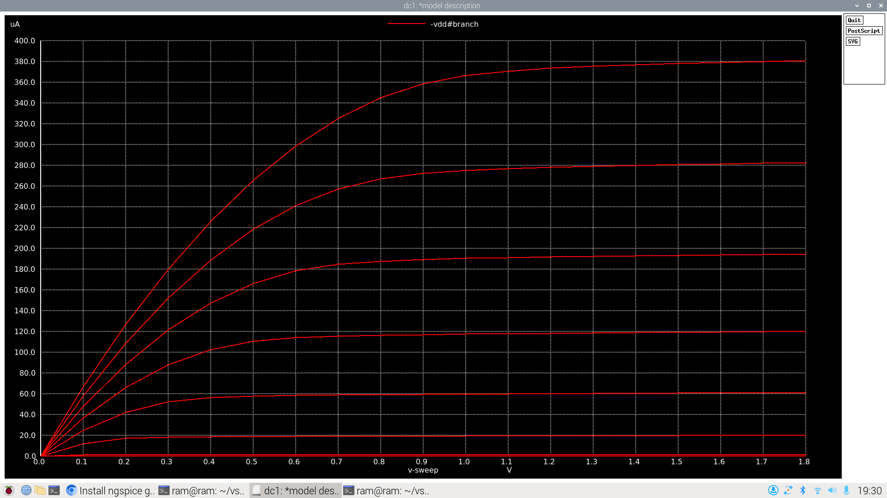
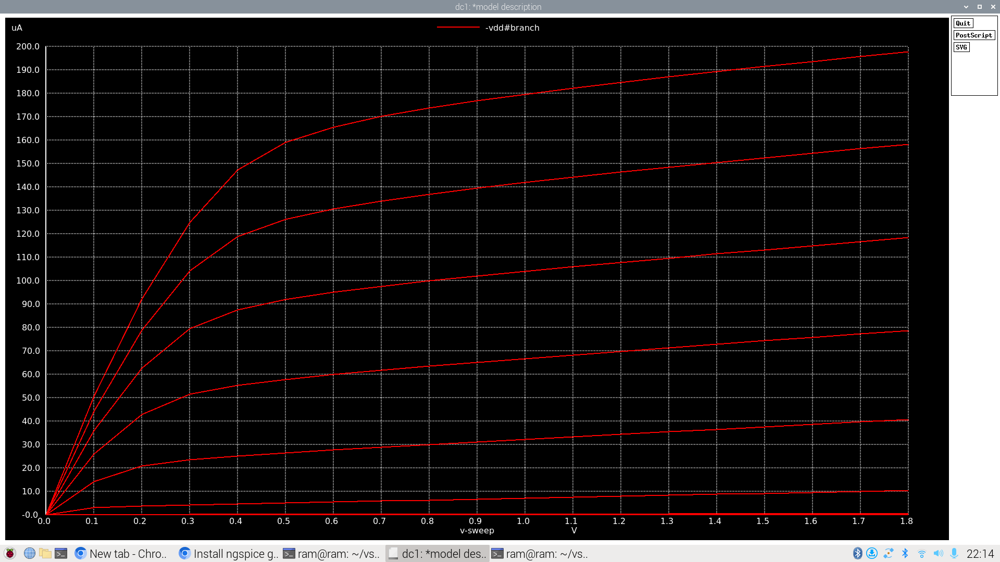
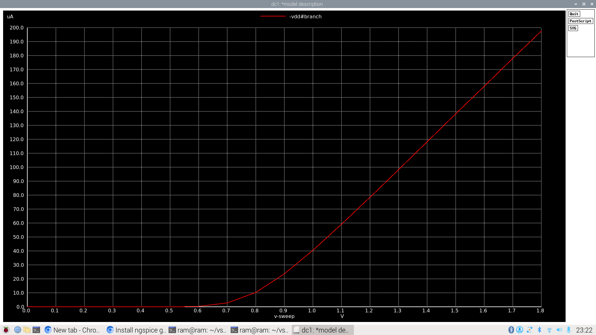
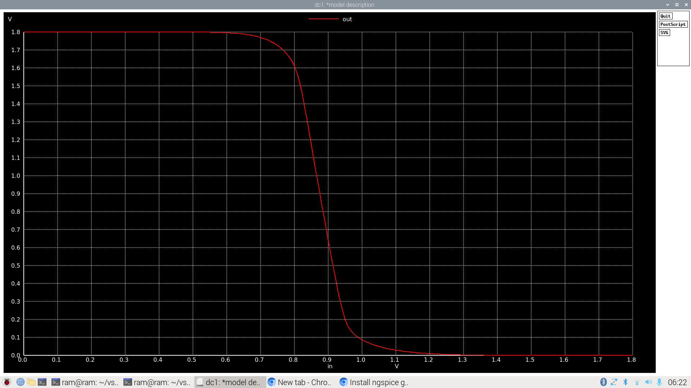
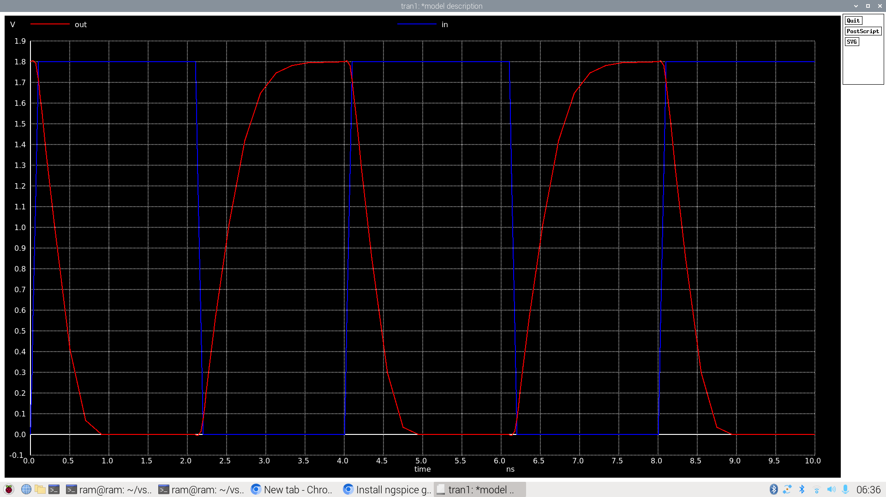
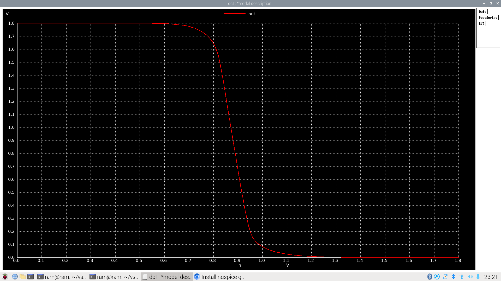
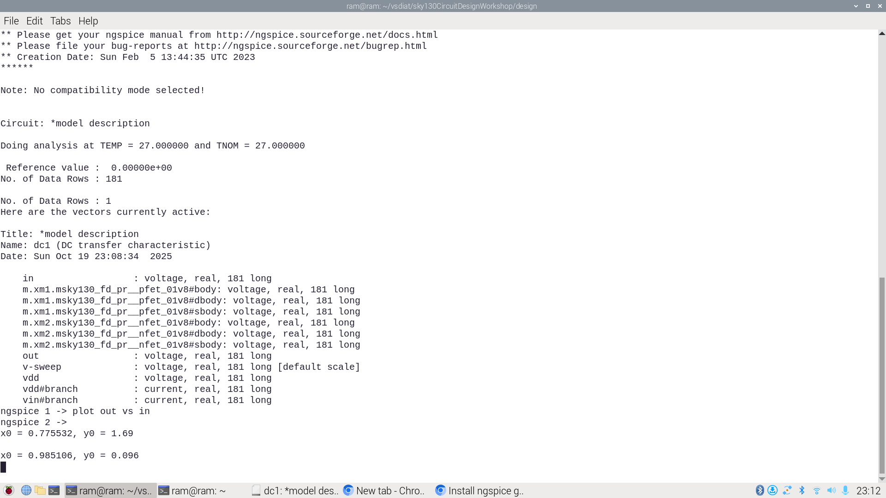
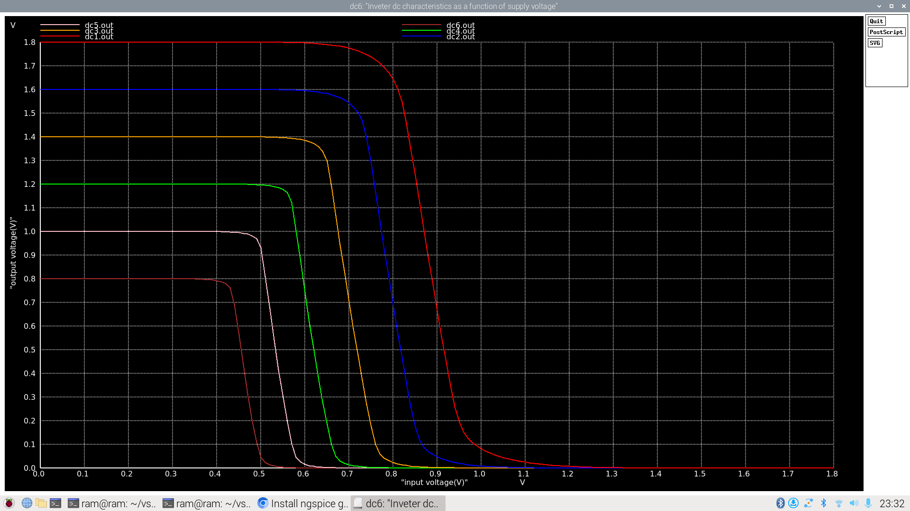
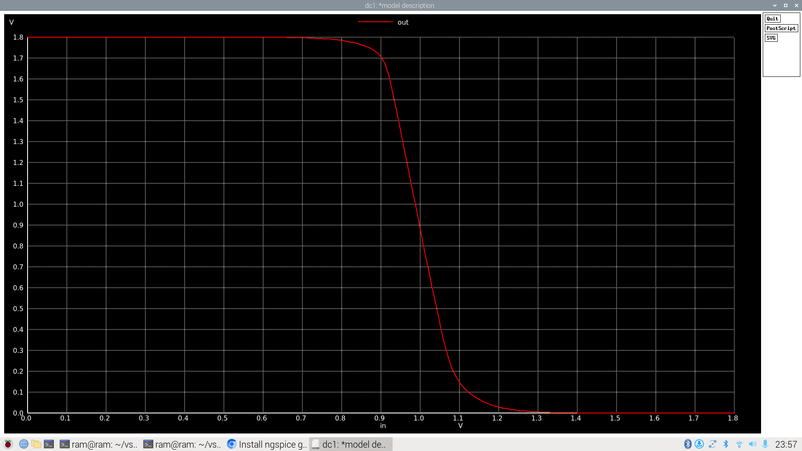

# ⚡ CMOS Circuit Design & Analysis using SkyWater 130nm PDK

> *A comprehensive exploration of MOSFET behavior, CMOS inverter characteristics, and circuit robustness using open-source tools and the SkyWater 130nm Process Design Kit*

---

## 📋 Table of Contents

- [Overview](#overview)
- [Prerequisites](#prerequisites)
- [Task 1: MOSFET I-V Characteristics](#task-1-mosfet-i-v-characteristics)
- [Task 2: Threshold Voltage & Velocity Saturation](#task-2-threshold-voltage--velocity-saturation)
- [Task 3: CMOS Inverter VTC Analysis](#task-3-cmos-inverter-vtc-analysis)
- [Task 4: Transient Response Analysis](#task-4-transient-response-analysis)
- [Task 5: Noise Margin Extraction](#task-5-noise-margin-extraction)
- [Task 6: Robustness Analysis](#task-6-robustness-analysis)
- [Key Insights](#key-insights)
- [References](#references)

---

## 🎯 Overview

This repository documents a hands-on journey through analog and digital CMOS circuit design, focusing on understanding fundamental transistor behavior and its impact on digital logic gates. Using the open-source **SkyWater 130nm PDK** and **ngspice** simulator, we explore:

- Individual MOSFET characteristics (Id-Vds, Id-Vgs curves)
- Threshold voltage extraction and velocity saturation effects
- CMOS inverter voltage transfer characteristics (VTC)
- Transient switching behavior and propagation delays
- Noise margin calculations for robustness analysis
- Impact of power supply and device variations

**Why This Matters**: Every digital chip—from microprocessors to memory arrays—is built from billions of transistors. Understanding their behavior at the device level is essential for designing reliable, high-performance integrated circuits.

---

## 🛠️ Prerequisites

### Required Tools

| Tool | Purpose | Installation |
|:-----|:--------|:-------------|
| **ngspice** | SPICE circuit simulator | `sudo apt install ngspice` |
| **SkyWater 130nm PDK** | Open-source process design kit | Clone from [SkyWater PDK repo](https://github.com/google/skywater-pdk) |
| **Python 3.x** (optional) | Post-processing and plotting | `sudo apt install python3` |

### Getting Started

```bash
# Clone the SkyWater PDK models
git clone https://github.com/google/skywater-pdk.git

# Navigate to your working directory
cd week4

# Verify ngspice installation
ngspice --version
```

---

## 📊 Task 1: MOSFET I-V Characteristics

### Objective
Characterize the current-voltage relationship of an NMOS transistor to understand its operating regions (linear and saturation).

### Circuit Configuration

```spice
*NMOS I-V Characteristics
XM1 Vdd n1 0 0 sky130_fd_pr__nfet_01v8 w=1.8 l=1.2
R1 n1 in 55
Vdd vdd 0 1.8V
Vin in 0 1.8V
.dc Vdd 0 1.8 0.1 Vin 0 1.8 0.2
```

**Device Specs:**
- Width (W) = 1.8 µm
- Length (L) = 1.2 µm
- VDD = 1.8V

### Simulation

```bash
ngspice spice_files/design/day1_nfet_idvds_L2_W5.spice
```

**Inside ngspice console:**
```
plot -vdd#branch
```

### Results

<div align="center">


*Figure 1: Drain current (Id) vs. Drain-Source voltage (Vds) for various gate voltages*
</div>

### Key Observations

| Region | Behavior | Design Application |
|:-------|:---------|:-------------------|
| **Linear** | Id ∝ Vds (resistive behavior) | Analog switches, pass transistors |
| **Saturation** | Id ≈ constant (current source) | Amplifiers, current mirrors |
| **Transition** | Occurs at Vds ≈ (Vgs - Vt) | Defines operating mode boundary |

**Insights:**
- Higher Vgs → Higher drain current (stronger channel)
- Saturation region exhibits flat plateaus (ideal for current-source operation)
- Linear region shows steep slope (low on-resistance for switching)

---

## ⚡ Task 2: Threshold Voltage & Velocity Saturation

### Objective
Extract the threshold voltage (Vt) and explore velocity saturation effects in short-channel devices.

### Experiment 2A: Id vs Vds (Short-Channel Device)

**Device Specs:**
- Width (W) = 0.39 µm
- Length (L) = 0.15 µm (short channel!)
- Aspect ratio: W/L = 2.6

```bash
ngspice spice_files/design/day2_nfet_idvds_L015_W039.spice
```

<div align="center">


*Figure 2: Short-channel MOSFET characteristics showing velocity saturation effects*
</div>

### Experiment 2B: Id vs Vgs (Transfer Characteristic)

```bash
ngspice spice_files/design/day2_nfet_idvgs_L015_W039.spice
```

<div align="center">


*Figure 3: Transfer characteristic revealing threshold voltage behavior*
</div>

### Threshold Voltage Extraction

**Method:** Square-root extrapolation
- Plot √Id vs Vgs
- Extrapolate linear region back to x-axis
- X-intercept = Vt

**Extracted Values:**

| Channel Length | Vt (approx) | Observation |
|:---------------|:------------|:------------|
| L = 1.2 µm | ~0.45 V | Long channel—minimal short-channel effects |
| L = 0.15 µm | ~0.38 V | Short-channel effects reduce Vt slightly |

### Velocity Saturation Impact

```
Long-Channel (L > 1 µm):
  • Id ∝ (Vgs - Vt)²  [quadratic]
  • Higher current capability

Short-Channel (L < 250 nm):
  • Id ∝ (Vgs - Vt)   [linear!]
  • Velocity saturation limits current
  • ~50% current reduction
  • BUT faster switching speed!
```

**The Trade-off:** Shorter transistors switch faster but deliver less current due to electrons hitting their velocity limit (~10⁷ cm/s in silicon).

---

## 🔄 Task 3: CMOS Inverter VTC Analysis

### Objective
Characterize the Voltage Transfer Characteristic (VTC) of a CMOS inverter to understand switching behavior and gain.

### Circuit Configuration

```spice
*CMOS Inverter
XM1 out in vdd vdd sky130_fd_pr__pfet_01v8 w=0.84 l=0.15  ; PMOS
XM2 out in 0 0 sky130_fd_pr__nfet_01v8 w=0.36 l=0.15      ; NMOS
Cload out 0 50fF
Vdd vdd 0 1.8V
```

**Design Rationale:**
- Wp/Wn = 0.84/0.36 = 2.33
- Ratio compensates for hole mobility (~2.5× slower than electrons)
- Targets balanced switching threshold Vm ≈ VDD/2

### Simulation

```bash
ngspice spice_files/design/day3_inv_vtc_Wp084_Wn036.spice
```

**Plotting commands:**
```
plot v(out) vs v(in)              # VTC curve
plot v(out) v(in) vs v(in)        # Find Vm (crossover point)
```

### Results

<div align="center">


*Figure 4: Voltage Transfer Characteristic showing sharp transition region*
</div>

### Measured Parameters

| Parameter | Value | Specification | Status |
|:----------|:------|:--------------|:-------|
| **Vm** (Switching threshold) | 0.879 V | 0.8 - 1.0 V | ✅ Excellent |
| **VOH** (Output high) | 1.800 V | ≈ VDD | ✅ Rail-to-rail |
| **VOL** (Output low) | ~0 V | < 50 mV | ✅ Perfect |
| **Transition width** | ~0.4 V | Sharp is better | ✅ Good gain |

**Analysis:**
- **Vm ≈ 0.88V** is close to VDD/2, indicating balanced design
- **Sharp transition** demonstrates high voltage gain (good regenerative feedback)
- **Rail-to-rail output swing** maximizes noise immunity
- Proper Wp/Wn ratio achieved symmetric switching behavior

---

## ⚡ Task 4: Transient Response Analysis

### Objective
Measure real-time switching behavior: rise/fall times and propagation delays.

### Input Stimulus

```spice
Vin in 0 PULSE(0V 1.8V 0 0.1ns 0.1ns 2ns 4ns)
         │   │   │   │     │    │   └─ Period (4ns → 250 MHz)
         │   │   │   │     │    └───── Pulse width (2ns)
         │   │   │   │     └────────── Fall time (0.1ns)
         │   │   │   └──────────────── Rise time (0.1ns)
         │   │   └──────────────────── Delay (immediate start)
         │   └──────────────────────── High level
         └──────────────────────────── Low level
```

### Simulation

```bash
ngspice spice_files/design/day3_inv_tran_Wp084_Wn036.spice
```

**Inside ngspice:**
```
plot v(in) v(out)
```

### Results

<div align="center">


*Figure 5: Input (blue) and Output (red) waveforms showing switching dynamics*
</div>

### Measured Timing Parameters

| Parameter | Definition | Measured Value | Threshold Points |
|:----------|:-----------|:---------------|:-----------------|
| **tr** (Rise time) | 10% → 90% transition | **661.76 ps** | 0.18V → 1.62V |
| **tf** (Fall time) | 90% → 10% transition | **475.07 ps** | 1.62V → 0.18V |
| **tPLH** (Prop. delay L→H) | 50% input → 50% output | ~662 ps | Vin, Vout @ 0.9V |
| **tPHL** (Prop. delay H→L) | 50% input → 50% output | ~475 ps | Vin, Vout @ 0.9V |

### Key Observations

**Why is Fall Time Faster?**
```
Fall (475ps) < Rise (662ps)

Reason: NMOS has higher mobility than PMOS
        (electrons > holes)

Even with Wp = 2.33 × Wn, NMOS still wins!
```

**Maximum Operating Frequency:**
```
Average propagation delay: tP = (tPLH + tPHL)/2 = 568.5 ps
Maximum toggle frequency: fmax ≈ 1/(2×tP) ≈ 879 MHz
```

**Design Implications:**
- Asymmetric timing may require adjustment in high-speed designs
- Could increase PMOS width further to balance rise/fall times
- Trade-off: larger area, more power consumption

---

## 🛡️ Task 5: Noise Margin Extraction

### Objective
Calculate noise margins (NML, NMH) to quantify circuit robustness against signal disturbances.

### Theory: The Four Critical Voltages

```
VOH ────────────┐
                │ ← NMH = VOH - VIH (High noise margin)
VIH ────────────┤
                │ ← Undefined transition region
VIL ────────────┤
                │ ← NML = VIL - VOL (Low noise margin)
VOL ────────────┘
```

| Voltage | Definition | Where Found |
|:--------|:-----------|:------------|
| **VOH** | Maximum output high | VTC flat region (Vin ≈ 0) |
| **VOL** | Minimum output low | VTC flat region (Vin ≈ VDD) |
| **VIL** | Maximum input low | dVout/dVin = -1 (rising edge) |
| **VIH** | Minimum input high | dVout/dVin = -1 (falling edge) |

### Simulation

```bash
ngspice spice_files/design/day4_inv_noisemargin_wp1_wn036.spice
```

**Device configuration:**
- PMOS: W = 1.0 µm, L = 0.15 µm
- NMOS: W = 0.36 µm, L = 0.15 µm
- Wp/Wn ratio = 2.78

### Results

<div align="center">


*Figure 6: VTC with critical voltages marked for noise margin extraction*
</div>

<div align="center">


*Figure 7: Unity-gain points defining VIL and VIH thresholds*
</div>

### Extracted Parameters

| Parameter | Value | Calculation | Result |
|:----------|:------|:------------|:-------|
| **VOH** | 1.800 V | Direct measurement | Rail-to-rail ✅ |
| **VOL** | ~0.0006 mV | Direct measurement | Essentially 0V ✅ |
| **VIL** | 0.7436 V | Where gain = -1 (left) | Good separation ✅ |
| **VIH** | 1.0036 V | Where gain = -1 (right) | Good separation ✅ |

### Computed Noise Margins

```
NMH = VOH - VIH = 1.800 - 1.0036 = 0.796 V  (44.2% of VDD) ⭐⭐⭐⭐⭐
NML = VIL - VOL = 0.7436 - 0.0006 = 0.743 V (41.3% of VDD) ⭐⭐⭐⭐⭐
```

**Rating System:**

| Noise Margin | % of VDD | Quality Rating | Robustness |
|:-------------|:---------|:---------------|:-----------|
| > 40% | Excellent | ⭐⭐⭐⭐⭐ | Industrial-grade |
| 30-40% | Good | ⭐⭐⭐⭐ | Commercial-grade |
| 20-30% | Marginal | ⭐⭐⭐ | Requires careful layout |
| < 20% | Poor | ⭐⭐ | High failure risk |

**Our Design:** Both noise margins exceed 40% of VDD—excellent robustness!

---

## 🔬 Task 6: Robustness Analysis

### Objective
Stress-test the inverter against real-world variations:
1. Power supply fluctuations (voltage scaling)
2. Manufacturing variations (device sizing)

---

### Experiment 6A: Supply Voltage Variation

**Question:** What happens when VDD droops from 1.8V down to 0.8V?

```bash
ngspice spice_files/design/day5_inv_supplyvariation_Wp1_Wn036.spice
```

**Test Configuration:**
- Sweep VDD: 1.8V, 1.6V, 1.4V, 1.2V, 1.0V, 0.8V
- Fixed device sizes: Wp = 1.0 µm, Wn = 0.36 µm

### Results

<div align="center">


*Figure 8: VTC curves collapse as VDD decreases—note the shrinking noise margins*
</div>

### Analysis: Voltage Starvation Effects

| VDD (V) | VOH (V) | VOL (V) | VIL (V) | VIH (V) | Vm (V) | NML (V) | NMH (V) | Status |
|:-------:|:-------:|:-------:|:-------:|:-------:|:------:|:-------:|:-------:|:------:|
| **1.8** | 1.800 | ~0 | 0.744 | 1.004 | 0.879 | 0.744 | 0.796 | 🟢 Excellent |
| **1.6** | 1.600 | ~0 | 0.687 | 0.913 | 0.791 | 0.687 | 0.687 | 🟢 Good |
| **1.4** | 1.400 | ~0 | 0.621 | 0.787 | 0.700 | 0.621 | 0.613 | 🟡 Marginal |
| **1.2** | 1.200 | ~0 | 0.549 | 0.685 | 0.611 | 0.549 | 0.515 | 🟠 Risky |
| **1.0** | 1.000 | ~0 | 0.482 | 0.594 | 0.531 | 0.482 | 0.406 | 🔴 Danger |
| **0.8** | 0.800 | ~0 | 0.419 | 0.514 | 0.458 | 0.419 | 0.286 | 🔴 Critical |

**Critical Observations:**

```
VDD ↓  →  Vm ↓  →  Noise Margins ↓  →  Circuit Fragility ↑

At 0.8V: NMH = 286mV (only 35.7% of VDD!)
         One glitch away from logic errors!
```

**Design Guidelines:**
- Always design with ≥20% supply margin
- Account for IR drop in power distribution networks
- Use voltage regulators to stabilize VDD
- Verify timing across all PVT (Process, Voltage, Temperature) corners

---

### Experiment 6B: Device Variation Analysis

**Question:** How does changing transistor sizes affect switching threshold and noise margins?

```bash
ngspice spice_files/design/day5_inv_devicevariation_wp7_wn042.spice
```

**Test Configuration:**
- Vary PMOS width: 0.6 µm, 1.0 µm, 1.5 µm, 2.0 µm, 7.0 µm
- NMOS width: Fixed at 0.36 µm (except one case at 0.42 µm)

### Results

<div align="center">


*Figure 9: Switching threshold shifts with transistor sizing—the Wp/Wn tug-of-war*
</div>

### Analysis: The Transistor Sizing Battle

**The Fundamental Principle:**

```
PMOS Width ↑              NMOS Width ↑
     ↓                         ↓
Stronger Pull-Up          Stronger Pull-Down
     ↓                         ↓
Vm Shifts UP              Vm Shifts DOWN
     ↓                         ↓
NMH Improves              NML Improves
(NML degrades)            (NMH degrades)
```

**You Can't Win Both!** It's a zero-sum game.

### Device Sizing Summary

| Config | Wp (µm) | Wn (µm) | Wp/Wn | Vm (V) | NML (V) | NMH (V) | Balance |
|:------:|:-------:|:-------:|:-----:|:------:|:-------:|:-------:|:-------:|
| 1 | 0.60 | 0.36 | 1.67 | 0.802 | 0.802 | 0.998 | NMOS dominant |
| 2 | 1.00 | 0.36 | 2.78 | 0.879 | 0.743 | 0.796 | Well balanced ✅ |
| 3 | 1.50 | 0.36 | 4.17 | 0.925 | 0.689 | 0.875 | PMOS dominant |
| 4 | 2.00 | 0.36 | 5.56 | 0.954 | 0.662 | 0.921 | PMOS very strong |
| 5 | 7.00 | 0.42 | 16.67 | 1.120 | 0.574 | 1.146 | Extremely unbalanced |

**Design Insights:**

1. **Optimal Balance:** Wp/Wn ≈ 2.5-3.0 gives Vm close to VDD/2
2. **Trade-offs Are Real:** Improving one noise margin always degrades the other
3. **Extreme Ratios:** Wp/Wn > 10 creates highly asymmetric behavior (rarely desired)

**Connection to STA (Static Timing Analysis):**
- Vm variations affect propagation delay
- Unbalanced designs create timing skew
- Multi-corner analysis must verify all PVT combinations
- Critical paths are especially sensitive to Vm shifts

---

## 🎓 Key Insights

### 💎 The Golden Rules of CMOS Design

1. **📊 MOSFET Behavior Dictates Everything**
   - Linear region: Low Rds(on) for efficient switches
   - Saturation region: Constant current for amplifiers
   - Velocity saturation: Speed vs. current trade-off in short channels

2. **⚖️ Balance is Beautiful**
   - Wp/Wn ≈ 2.5 compensates for mobility difference
   - Vm ≈ VDD/2 maximizes symmetric noise margins
   - Can't optimize everything—design is about trade-offs

3. **🛡️ Robustness Requires Margins**
   - Target noise margins > 40% of VDD
   - Design for worst-case supply voltage (VDD − IR drop)
   - Account for ±10% device variations in manufacturing

4. **⚡ Speed Comes at a Cost**
   - Faster edges → More power consumption (P = C·V²·f)
   - Wider transistors → Larger area + more capacitance
   - Always verify power-performance-area (PPA) trade-offs

5. **🔗 Device → Circuit → System**
   - Individual transistor Id-Vds curves determine gate delays
   - Gate delays determine critical path timing
   - Timing margins determine maximum clock frequency
   - One weak link breaks the entire chain!

### 📐 Design Decision Framework

```
Requirements:
    Speed? → Increase W (more current)
    Power? → Decrease W, increase L (less leakage)
    Area?  → Minimum sizing, share resources
    
Constraints:
    Timing closure? → Must meet tsetup, thold
    Noise immunity? → Need adequate NML, NMH
    Yield?         → Robust to process variations
    
Trade-off Space:
    ┌─────────────────────────────┐
    │  Fast + Low Power + Small   │  ← Pick any 2!
    │  (Can't have all three!)    │
    └─────────────────────────────┘
```

---

## 📂 Repository Structure

```
week4/
├── spice_files/
│   └── design/
│       ├── day1_nfet_idvds_L2_W5.spice
│       ├── day2_nfet_idvds_L015_W039.spice
│       ├── day2_nfet_idvgs_L015_W039.spice
│       ├── day3_inv_vtc_Wp084_Wn036.spice
│       ├── day3_inv_tran_Wp084_Wn036.spice
│       ├── day4_inv_noisemargin_wp1_wn036.spice
│       ├── day5_inv_supplyvariation_Wp1_Wn036.spice
│       └── day5_inv_devicevariation_wp7_wn042.spice
│
├── ID_VS_VDS_CURVES_day1_ngspice.png
├── lower_node_id_vs_vds_ngspice_plot_day2.png
├── lower_node_id_vs_vgs_ngspice_plot_day2.png
├── inverter_vtc_characteristics_day3_ngspice_waveform.png
├── inverter_transient_analysis_day3_ngspice.png
├── Noise_margin_simulations_inverter_day4.png
├── VIL_vs_VOH_and_VIH_vs_VOL_day4_ngspice.png
├── vtc_for_supply_variations_inverter_day5.png
├── device_variation_simulations_day5.png
└── README.md
```

---

## 🔗 References

### 📚 Essential Resources

1. **SkyWater 130nm PDK**  
   [github.com/google/skywater-pdk](https://github.com/google/skywater-pdk)  
   *Open-source process design kit for reproducible research*

2. **ngspice Documentation**  
   [ngspice.sourceforge.net](http://ngspice.sourceforge.net/)  
   *Comprehensive SPICE simulation reference*

3. **Classic Textbooks**
   - Jan M. Rabaey et al., *Digital Integrated Circuits: A Design Perspective*
   - Behzad Razavi, *Design of Analog CMOS Integrated Circuits*
   - Neil H.E. Weste & David Harris, *CMOS VLSI Design*

4. **Academic Papers**
   - "Velocity Saturation in Short-Channel MOSFETs" (IEEE Transactions)
   - "Noise Margins in CMOS Logic Gates" (Various conference proceedings)

---

<div align="center">

**⚡ From Transistors to Chips—One Simulation at a Time ⚡**

*Understanding the fundamentals today enables designing the breakthroughs of tomorrow*

</div>
